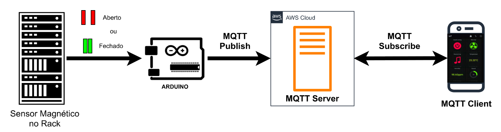
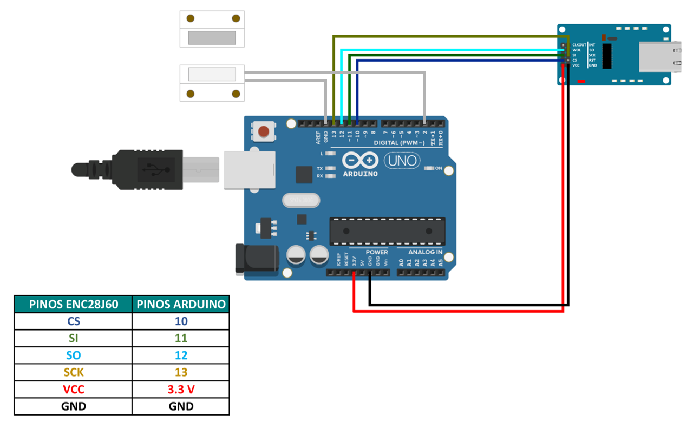

**# projeto-mqtt-lucasaraujo**

## Sensor Magnético.

  Esse projeto ilustra utilizar o Arduino como um 'Sensor Magnético',  para monitorar se a porta de um Rack
  de Rede está ABERTO ou FECHADO; enviar essa informação via Internet utilizando o protocolo MQTT (Message
  Queuing Telemetry Transport) para um servidor MQTT hospedado na Amazon Web Service (AWS) e exibir a informação
  em um cliente MQTT (MQTT Dash) instalado em um Smartphone, conforme imagem abaixo.

  

Foram utilizadas as seguintes bibliotecas:

- [PubSubClient](https://www.arduino.cc/reference/en/libraries/pubsubclient/) : Essa biblioteca é responsável pela conexão do cliente MQTT.
- [UIPEthernet](https://www.arduino.cc/reference/en/libraries/uipethernet/) : Essa biblioteca é responsável pela conexão entre o shield de REDE(ENC28J60) e o Arduino.

## Materiais

1. Arduino uno
2. Módulo Ethernet (ENC28J60)
3. Sensor Magnético (MC-38)
4. Jumpers

## Circuito

## **Autor:** Lucas Araujo

